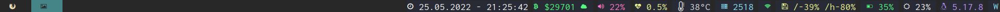
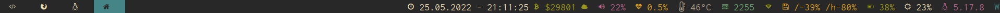

On 24 February 2022 Russia invaded Ukraine and is killing thousands of innocent
civilians. This has to stop! I named my new project after
[Kherson](https://en.wikipedia.org/wiki/Kherson), a city in the south of
Ukraine, to draw attention to this inacceptable issue.

---

# kherson

Minimalist status line generator for [i3](https://i3wm.org/) /
[sway](https://swaywm.org/) bar written in [Go](https://go.dev/) and configred
in [Yaml](https://yaml.org/).

In short, this is what [i3blocks](https://github.com/vivien/i3blocks) would
look like I had written it.

## Installation and configuration

Refer to the according [wiki pages](https://github.com/alexcoder04/kherson/wiki).

## Contributing

I'm generally open for any kind of contributions, however I try to keep this
project as simple and minimal as possible, so fancy complex features are
very unlikely to be accepted.

When in doubt, just open an [issue](https://github.com/alexcoder04/kherson/issues)
and we'll discuss your idea there.

